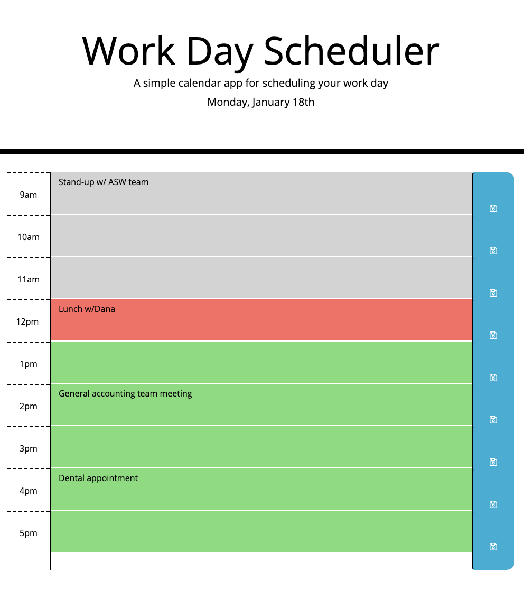

# Homework05-Calendar
Repository for Homework 05 - Work Day Scheduler
A simple calendar application

## Project Screen Shots

## Work Day Scheduler instructions
1. Open application and scroll down to view the hourly time blocks
2. Click into the desired text box and enter an event
3. Click the save button on the right side of the timeblock to save the appointment
4. Refresh the page to update the timeblocks' colors
## Application Criteria
1. When the user opens the planner, the current day is displayed at the top of the calendar
2. When the user scrolls down, they are presented with time blocks for standard business hours
3. Each time block is color-coded to indicate whether it is in the past, present, or future
4. When the user clicks into a time block, then they can enter an event
5. When the user clicks the save button for that time block, the text for that event is saved in local storage
6. When the user refreshes the page, the saved events persist